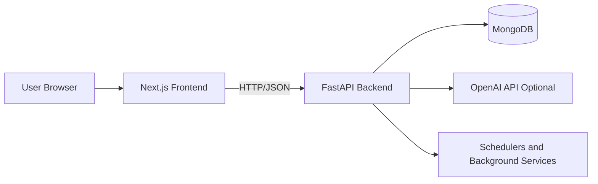

# KhoshGolpo

> **AI-augmented community platform for meaningful conversations.**  
> Built for modern product teams who want social engagement, smart moderation, and a production-ready stack.

KhoshGolpo combines a high-performance FastAPI backend with a polished Next.js frontend to deliver a social discussion experience with threads, messaging, profiles, recommendations, and AI-assisted trust & safety.

## Table of Contents

- [Why KhoshGolpo](#why-khoshgolpo)
- [Feature Highlights](#feature-highlights)
- [Tech Stack](#tech-stack)
- [Monorepo Structure](#monorepo-structure)
- [Quick Start (Recommended)](#quick-start-recommended)
- [Docker Setup (API + Mongo)](#docker-setup-api--mongo)
- [Environment Configuration](#environment-configuration)
- [Running Tests](#running-tests)
- [Demo Data Seeding (Optional)](#demo-data-seeding-optional)
- [API Overview](#api-overview)
- [Architecture Snapshot](#architecture-snapshot)
- [Production Deployment](#production-deployment)
- [Operations Playbook](#operations-playbook)
- [Security & Ops Notes](#security--ops-notes)
- [Troubleshooting](#troubleshooting)
- [FAQ](#faq)
- [Product Positioning (Marketing Copy)](#product-positioning-marketing-copy)
- [Launch Checklist](#launch-checklist)
- [Contributing](#contributing)
- [License](#license)

---

## Why KhoshGolpo

- **Ship faster** with a clean, modular full-stack architecture.
- **Scale confidently** with async-first APIs, MongoDB, and container-ready deployment.
- **Grow engagement** through threaded discussions, personalized feed logic, and social graph features.
- **Protect community quality** with optional AI moderation workflows and admin controls.

If you need a "community layer" for your product, KhoshGolpo gives you a serious head start.

---

## Feature Highlights

### Core Product

- Threaded conversations with replies
- Posts, users, channels, and profile slugs
- Connections and direct messaging
- Notifications and read-state tracking
- Admin APIs and moderation/audit primitives

### AI & Feed Intelligence

- Optional AI-assisted moderation and risk thresholds
- AI model settings via environment configuration
- Feed/ranking and interest job pipelines
- Bot scheduler and bot personas for engagement scenarios

### Developer Experience

- FastAPI auto docs (`/docs`)
- Typed frontend with TypeScript + React 19 + Next.js 16
- Dockerized backend + Mongo composition
- Test suite for key backend behavior

---

## Tech Stack

**Backend**
- FastAPI (`fastapi[standard]`)
- Beanie + Motor (MongoDB)
- Pydantic Settings
- JWT auth modes (`jwt` or `static`)
- SlowAPI rate limiting + Loguru logging

**Frontend**
- Next.js 16
- React 19
- Tailwind CSS 4
- SWR + Zustand + Ky

**Infra & Deploy**
- Docker / Docker Compose
- Render-ready backend config (`render.yaml`)
- Vercel-friendly frontend deployment

---

## Monorepo Structure

- `backend/` — FastAPI app, models, services, routers, tests
- `frontend/` — Next.js frontend app
- `shared/` — shared TypeScript constants/types
- `guide/` — internal guides, experiments, planning assets
- `docker-compose.yml` — local API + Mongo orchestration
- `render.yaml` — Render backend deployment blueprint

---

## Quick Start (Recommended)

### 1) Prerequisites

- Python **3.12+**
- Node.js **LTS**
- npm
- Docker Desktop (optional, but recommended for Mongo)

### 2) Backend setup

From repository root:

```powershell
python -m venv .venv
.\.venv\Scripts\python -m pip install --upgrade pip
.\.venv\Scripts\python -m pip install -r backend\requirements.txt
Copy-Item backend\.env.example backend\.env
```

> Important: In `backend/.env`, set a strong `JWT_SECRET_KEY` (32+ chars) when `AUTH_MODE=jwt`.

Run backend (dev mode):

```powershell
.\.venv\Scripts\python -m fastapi dev backend\app\main.py
```

Backend URLs:
- API base: `http://127.0.0.1:8000`
- Health: `http://127.0.0.1:8000/health`
- OpenAPI docs: `http://127.0.0.1:8000/docs`

### 3) Frontend setup

```powershell
cd frontend
cmd /c npm install
$env:NEXT_PUBLIC_API_URL="http://127.0.0.1:8000"
cmd /c npm run dev
```

Frontend URL:
- `http://127.0.0.1:3000`

---

## Docker Setup (API + Mongo)

Run from repository root:

```powershell
docker compose up --build
```

This starts:
- API: `http://localhost:8000`
- MongoDB: `mongodb://localhost:27017`

> Frontend runs separately in `frontend/`.

---

## Environment Configuration

### Backend: `backend/.env`

Start from `backend/.env.example`.

| Variable | Required | Default | Purpose |
|---|---:|---|---|
| `APP_NAME` | No | `KhoshGolpo API` | Service name in docs/logs |
| `API_VERSION` | No | `0.1.0` | API version label |
| `ENVIRONMENT` | No | `development` | `development/staging/production` |
| `MONGODB_URI` | Yes | `mongodb://localhost:27017` | Mongo connection URI |
| `MONGODB_DB_NAME` | Yes | `khoshgolpo` | Database name |
| `CORS_ORIGINS` | Yes | local origins | Comma-separated frontend origins |
| `AUTH_MODE` | Yes | `jwt` | `jwt` or `static` auth mode |
| `JWT_SECRET_KEY` | Yes* | placeholder | Required + validated in `jwt` mode |
| `JWT_ALGORITHM` | No | `HS256` | JWT signing algorithm |
| `ACCESS_TOKEN_EXPIRE_MINUTES` | No | `1440` | Access token lifetime |
| `OPENAI_API_KEY` | Optional | empty | Enables AI features requiring OpenAI |
| `AI_MODEL` | No | `gpt-4o-mini` | AI model identifier |
| `AI_WARNING_THRESHOLD` | No | `0.6` | AI warning threshold |
| `AI_FLAG_THRESHOLD` | No | `0.8` | AI flag threshold |

\* In `AUTH_MODE=jwt`, `JWT_SECRET_KEY` must be changed and be at least 32 characters.

### Frontend env

| Variable | Required | Default fallback | Purpose |
|---|---:|---|---|
| `NEXT_PUBLIC_API_URL` | Recommended | `http://localhost:8000` | Backend API base URL |

---

## Running Tests

From `backend/`:

```powershell
..\.venv\Scripts\python -m pytest
```

Tip: tests default `AUTH_MODE` to `static` in `backend/tests/conftest.py` to avoid JWT secret validation issues.

---

## Demo Data Seeding (Optional)

Populate a rich sample dataset (users, threads, posts, bots, notifications, etc.):

```powershell
cd backend
..\.venv\Scripts\python scripts\seed.py
```

Seed script includes demo accounts (for local development only), such as:
- `demo@demo.com / demo123`
- `admin@demo.com / admin1234`

> Never use demo credentials in production.

---

## API Overview

Routers include:

- auth
- users
- threads
- posts
- messages
- channels
- notifications
- connections
- feed
- ai
- bot
- admin
- admin_feed
- health

Explore all routes interactively at `/docs`.

---

## Architecture Snapshot



### Request Flow

1. User interacts with the Next.js UI.
2. Frontend calls backend endpoints using `NEXT_PUBLIC_API_URL`.
3. FastAPI validates/authenticates request and executes business logic.
4. Data is read/written in MongoDB via Beanie/Motor.
5. Optional AI logic runs for moderation/feed signals.
6. JSON response is returned to the UI.

---

## Production Deployment

### Backend on Render

This repo ships with `render.yaml` that points to:
- `backend/Dockerfile`
- health check: `/health`

Set these env vars in Render dashboard:
- `MONGODB_URI`
- `MONGODB_DB_NAME`
- `JWT_SECRET_KEY`
- `CORS_ORIGINS` (your frontend URL)
- optionally `OPENAI_API_KEY` and AI thresholds/model

### Frontend on Vercel

Deploy the `frontend/` directory and set:
- `NEXT_PUBLIC_API_URL=https://<your-backend-domain>`

---

## Operations Playbook

### Local dev startup order

1. Start Mongo (`docker compose up` or local Mongo service).
2. Start backend (`fastapi dev`).
3. Start frontend (`npm run dev`).
4. Verify `/health` and `/docs` before feature work.

### Smoke test checklist

- `GET /health` returns `status: ok`.
- Frontend loads without CORS errors.
- Login/register flow works (if enabled in your auth mode).
- Create/read thread flow succeeds.
- Notifications/messages endpoints respond normally.

### Suggested pre-PR quality gate

- Backend tests pass.
- Frontend lint passes (`npm run lint`).
- No secrets committed.
- Any new env vars documented in README.

---

## Security & Ops Notes

- Use a **long, random JWT secret** in production.
- Restrict `CORS_ORIGINS` to trusted domains only.
- Keep `OPENAI_API_KEY` server-side only (never expose to browser).
- Run behind HTTPS in production.
- Use managed Mongo backups/snapshots for recovery.

---

## Troubleshooting

### Backend won’t start with JWT error

If you see validation errors about `jwt_secret_key`, ensure:

- `AUTH_MODE=jwt` has a real secret value (32+ chars), or
- use `AUTH_MODE=static` for local quick tests.

### CORS errors in browser

Update `CORS_ORIGINS` in `backend/.env` to include your frontend origin exactly (for example, `http://127.0.0.1:3000`).

### Frontend cannot reach backend

- Confirm backend is running on port `8000`.
- Set `NEXT_PUBLIC_API_URL` correctly.
- Restart frontend after changing env vars.

### Mongo connection issues

- Verify `MONGODB_URI` and database availability.
- For Docker Compose, check container health/logs.
- Confirm port `27017` is not blocked by another service.

### Rate limit responses (HTTP 429)

The backend includes rate limiting; reduce request burst frequency during load testing or tune limits in your backend implementation.

---

## FAQ

### Is OpenAI required?

No. AI-related features are optional. You can run KhoshGolpo without setting `OPENAI_API_KEY`.

### Can I use this as API-only?

Yes. Backend routes and docs are independently usable at `/docs`.

### Is Docker mandatory for local development?

No. Docker is recommended for consistent Mongo setup, but local services work too.

### Which auth mode should I use?

- `jwt`: production-like mode (recommended for real usage)
- `static`: simplified mode for certain local/test flows

---

## Product Positioning (Marketing Copy)

KhoshGolpo is not just a forum clone—it’s a **conversation engine** for communities that care about quality, trust, and momentum.

Whether you’re building a developer community, an edtech network, or a niche interest platform, KhoshGolpo gives you:

- **A compelling social core** (threads, profiles, messaging, notifications)
- **Operational confidence** (admin controls, moderation signals, auditability)
- **Growth leverage** (intelligent feed features, bot-assisted activity, extensible AI hooks)

In short: build your community product faster, launch with confidence, and iterate like a modern SaaS team.

---

## Launch Checklist

Before going live:

- [ ] Production `JWT_SECRET_KEY` is strong and unique
- [ ] `CORS_ORIGINS` restricted to production frontend domain(s)
- [ ] Mongo backups and restore process verified
- [ ] API health checks monitored
- [ ] Error logging and alerting configured
- [ ] AI settings reviewed (`AI_MODEL`, thresholds)
- [ ] Demo users and sample data removed from production
- [ ] License section updated for distribution

---

## Contributing

1. Create a feature branch.
2. Keep changes scoped and documented.
3. Run backend tests before opening a PR.
4. Submit a PR with a clear summary and screenshots for UI changes.

---

## License

Add your project license here (for example: MIT, Apache-2.0, or proprietary).

